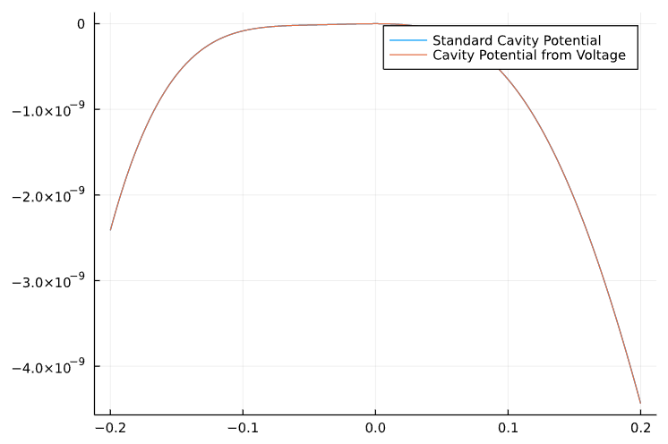

这里用来测试`getPotenWake`。

本函数有两个方法，第二个方法具有一般性。因此只测试第二个方法。

第一个方法比较简单，依赖于`getWakeVoltage`和`getPotenWake`的第二个方法。因此不进行验证。


---


Replace `wakevolvec` by `cavityvolvec`.

So the 2nd method can get`cavity potential`， which can be compared with `getPotenCavity`。



We can see that the method

```julia
getPotenWake(zvec::Vector{Float64}, wakevolvec::Vector{Float64}, Δz, centerenergy, circum)
```

can get "potential" from "voltage", and of course "wake potential" from "wake voltage".


---


Updated on 2022-09-08:

The zero point of potential are assumed $z=0$ before, but assumed $z=zR$ later. Because we only want to change and update low bound of $z$.