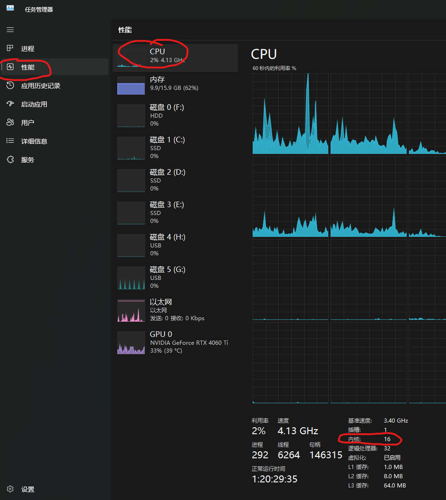
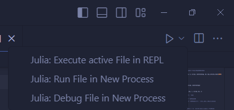

# Home
这个Julia包是我研究双高频系统过程中，用到的函数库。

## Julia的使用

### Julia快速入门

julia语法的入门可以到下面的网址去挑选你熟悉的语言比较[它们的显著差异](https://docs.juliacn.com/latest/manual/noteworthy-differences/)。

### Julia多线程支持
安装完Julia之后，在任务管理器中，点击“性能”-“CPU”，在右下角找到“内核”。如下图，内核数为`16`。

然后Windows系统可以搜索“编辑系统环境变量”，在“环境变量”中添加变量，变量名：`JULIA_NUM_THREADS`，变量值为电脑内核数。

对于Linux工作站，需要自己用代码查看其内核数，然后在`.bashrc`中使用`export JULIA_NUM_THREADS=48`添加环境变量。

有测试表明，如果超过电脑内核数，计算速度反而会降低。因此，即使你电脑线程数更多，此设置也不要超过内核数。

### Julia编辑器的选择
我推荐几种编辑方式。

比较小的项目，或者实验性程序，可以用Jupyter Notebook。这样可以边写代码，边记笔记。且VS Code可以远程打开工作站的Jupyter Notebook，非常方便。

写大型项目，推荐原生VS Code或者国内改版的VS Code——Syslab。

你如果电脑有VS Code且懒得装新编辑器，需要自己下载Julia编译器，然后安装VS Code `Julia`插件。并且在右上角“运行”图标右侧选择“Excecute active in REPL”。这会使得你当前打开的代码文件在REPL中运行——意味着函数、变量全部写入了REPL内存中，你可以在REPL内打印变量、导入绘图包观察函数关系。



你也可以选择同元软控的**个人版**或**教育版**Syslab。
它基于VS Code的开源代码，扩展了其功能，具有方便的绘图界面。可以像MATLAB那样，通过点击选择变量，然后有多种绘图方式提供选择。而且，由于是用VS Code改的，你可以使用VS Code的各种插件，比如CodeGeeX等等。
注意，Syslab内嵌Julia程序，你无需额外下载。

如果你有教育邮箱，可以使用**教育版**，功能更全些。他们拿Julia官方开源代码拿来做了优化——比如`Plots`被他们改成了`TyPlots`，画的图更像MATLAB了。

如果你没有教育邮箱，**个人版**Syslab也能用，只是会阉割掉部分同元做优化的库。我不是太喜欢。但是你仍然可以用`] add 包名`安装Julia官方的库。


## DoubleRF包的使用


### 包依赖项的安装
一般注册过的包安装时，都可以用`] add DoubleRFs`来安装。同时依赖的包，比如`FFTW`,`Interpolations`,`IntervalArithmetic`等都会自动安装到本地来。

然而我这种本地的包，暂时不知道怎么弄。首次在本机运行的话，暂时就通过手动添加的方式安装依赖项吧。以后要是想维护、拓展本包，这都是必要的。

在julia REPL中，按下`]`进入包管理模式。然后输入：
```
add FFTW                    # 傅里叶变换相关
add Interpolations          # 插值相关
add IntervalArithmetic      # 区间算术
add IntervalRootFinding     # 基于区间算术的找根包，即使怀疑有根，也会告诉你
add QuadGK                  # 函数积分包
add LoopVectorization       # 向量化相关，增加计算速度
add CurveFit                # 曲线拟合包
```


### 本地包的导入
使用时需要先将DoubleRFs包的路径——或者`DoubleRFs`的父级目录——添加到julia的搜索路径中。
```julia
push!(LOAD_PATH, "E:/Documents/JuliaProgram/MyModules/")
```
这样就成功地将本地包路径添加到了julia搜索路径。这样可以在代码中`import`或者`using`调用包名。

如果你存在多个设备，比如“办公室电脑”、“个人PC”、“Linux工作站”，那么可以用下面的方式添加目录：
```julia
try
    global computername = ENV["COMPUTERNAME"] # 获取Windows电脑名称
catch
    global computername = ENV["HOSTNAME"] # 获取Linux工作站名称
end
if computername == "办公室电脑" # 如果电脑名称为"办公室电脑"
    push!(LOAD_PATH, "E:/Documents/JuliaProgram/MyModules/")
elseif computername=="localhost.localdomain"    # 如果工作站名称为"localhost.localdomain"
    push!(LOAD_PATH, "/home/xujingye/Julia/MyModules")
end
```
你可以添加为VSCode或者Syslab的代码片段，下次能便捷输入。


### 调用相关函数
调用的方式有两种：`using`和`import`。

(1)如果你使用：
```julia
using DoubleRFs
```
来使用这个包了，那么所有在`src/DoubleRFs.jl`中通过`export`导出的函数，都可以直接调用；没有`export`的，也可以用`DoubleRFs.函数名()`调用。

(2)如果你使用：
```julia
import DoubleRFs:one_turn_map
```
那么只能调用`one_turn_map`这个函数。

(3)或者你用：
```julia
import DoubleRFs
```
这样你可以用`DoubleRFs.one_turn_map`来调用函数。


`import`的好处是，只导入使用的函数，不怕命名冲突；而`using`会导入全部`export`的函数，可能会产生冲突。

导入包或函数之后，具体的使用案例，参见“示例”一节：
```@contents
Pages = ["examples.md"]
```

## 文件结构
如果你想扩展自己的双高频函数包，你需要了解这里的文件结构。

所有的函数都放在`/src/`文件夹中。其中`DoubleRFs.jl`与包名同名，这个文件很重要：向外提供了对接接口；向内管理着所有的函数。

```text
DoubleRFs
├── README.md
├── Manifest.toml
├── Project.toml
├── src                             # 源代码
│   ├── SimulationTools
│   │   ├── ST_MappingEquation.jl   # 单圈映射方程，用来进行粒子多圈迭代
│   │   │                           # 也可以保留历史坐标记录分析纵向振荡频率
│   │   └── ST_SynchroTuneSpread.jl # 分析纵向振荡频率分布
│   ├── GeneralTools
│   │   ├── GT_CurveFit.jl
│   │   ├── GT_Int.jl
│   │   ├── GT_MatrixDerivative.jl
│   │   ├── GT_Pad.jl
│   │   ├── GT_Random.jl
│   │   ├── GT_RemoveDataList.jl    # 早期测试阶段，我计算出来的角变量
│   │   │                           # 由于精度问题，在某些位置总是波动很大
│   │   │                           # 甚至超出(0, 2pi)范围，因此我利用
│   │   │                           # 这个，移除过近的点、超出范围的点
│   │   │                           # 不过后来不怎么用了，我们的库里实际没用过
│   │   ├── GT_Sample.jl            # 分为两个部分：1. 根据密度分布函数进行
│   │   │                           # 采样，这样一大群粒子在此坐标上的分布就
│   │   │                           # 满足此函数；2. 径向密度分布的积分接近1.
│   │   │                           # 我琢磨着除了目前的采样方式，是否存在适应
│   │   │                           # 性采样能够让计算更少。于是参考了自适应
│   │   │                           # Simpson法——对于梯形积分规则，斜率均匀
│   │   │                           # 的地方采样少，斜率变化大的地方采样密集。
│   │   │                           # 但是，密度分布斜率均匀就代表纵向工作点
│   │   │                           # 分布斜率均匀吗？未必。所以实际上弃用。
│   │   ├── GT_Sum.jl               # 偶然发现的精确求和法，电脑用二进制计算
│   │   │                           # 却要显示为十进制，所以有时会将比如2显示
│   │   │                           # 为1.9999999...。此求和法一定程度上能
│   │   │                           # 解决这个问题。不过我怕影响性能，没用。
│   │   └── GT_ZeroPoint.jl
│   ├── DataAnalysis
│   │   ├── DA_GrowthRate.jl
│   │   └── DA_RMS.jl
│   ├── ActionAngleVlasovSolver
│   │   ├── Sample
│   │   │   ├── AngleVariable.jl
│   │   │   ├── AngularSampling.jl
│   │   │   └── δJθ.jl.jl
│   │   ├── TMCI_Main.jl
│   │   ├── NumericalSpecialFunction.jl
│   │   └── TMCI_InteractionMatrix.jl
│   ├── DoubleRFs.jl
│   ├── FixedPoints.jl              # 求不动点的相关工具
│   ├── NormedDensity.jl
│   ├── Voltage.jl
│   ├── Potential.jl
│   └── Hamiltonian.jl
├── docs # 文档
└── test
```
文件结构符号可以在[这里打开](https://blog.csdn.net/huangzhiyuan_/article/details/132752382)。


