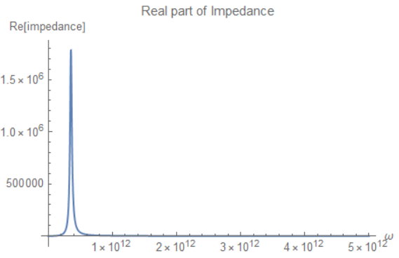
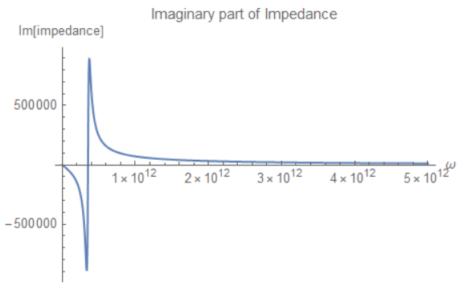
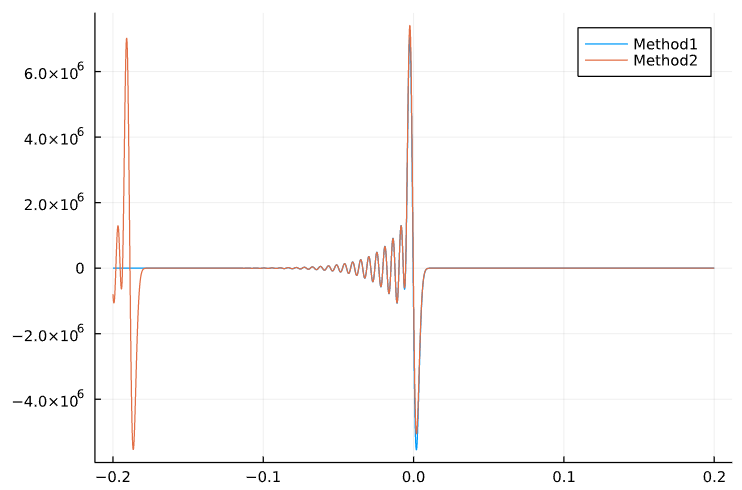

通过RLC模型，利用现成的wake和impedance公式，比较函数`getWakeVoltage`的两种方法。
$$
W'_m(z)=
\left\{
\begin{aligned}
& 0, & z>0 \\
& \alpha R_S, & z=0 \\
& 2 \alpha R_S \, e^{\alpha z/c} \left( \cos{\dfrac{\bar{\omega} z}{c}}+\dfrac{\alpha}{\bar{\omega}}\sin{\dfrac{\bar{\omega} z}{c}} \right), & z<0
\end{aligned}
\right.
$$

$$
\begin{aligned}
Z_m^\parallel &= \dfrac{R_S}{1+iQ\left( \dfrac{\omega_R}{\omega}-\dfrac{\omega}{\omega_R} \right)} \\
&=\dfrac{R_S\left(1-iQ\left( \dfrac{\omega_R}{\omega}-\dfrac{\omega}{\omega_R} \right)\right)}{1+Q^2 \left( \dfrac{\omega_R}{\omega}-\dfrac{\omega}{\omega_R} \right)^2} \\
&=\dfrac{R_S-i R_S Q\left( \dfrac{\omega_R}{\omega}-\dfrac{\omega}{\omega_R} \right)}{1+Q^2 \left( \dfrac{\omega_R}{\omega}-\dfrac{\omega}{\omega_R} \right)^2} 
\end{aligned}
$$

取`Rs=891898`,`ωR=2π*56e9`,`Q=10`.


第一种方法：

```julia
getWakeVoltage(zvec::Vector{Float64}, ρvec::Vector{Float64}, funz2wakez::Union{Interpolations.Extrapolation,Function}, Δz, Nb, elementcharge=1.6021766208e-19)
```

取`σz=0.00252`,`Δz=0.01σz`,`zvec=collect(-0.2:Δz:0.2)`,`ρvec=exp.(-0.5.*(zvec./σz).^2)/(sqrt(2π)*σz)`,`Nb=5e-9/1.6e-19`.

第二种方法：

```julia
getWakeVoltage(zvec::Vector{Float64}, ρvec::Vector{Float64}, ωvec::Vector{Float64}, reimpedancevec::Vector{Float64}, imimpedancevec::Vector{Float64}, Δω, Δz, Nb, elementcharge=1.6021766208e-19, clight=299792458.0)
```

其余和上面取相同。按上面设置，阻抗图片为：





因此，取`Δω=1e10`,`ωvec=collect(0:Δω:5e12)`,`reimpedance`和`imimpedance`分别取：
$$
\begin{aligned}
\text{Re}(Z_m^\parallel)=\dfrac{2R_S}{1+Q^2 \left( \dfrac{\omega_R}{\omega}-\dfrac{\omega}{\omega_R} \right)^2} \\
\text{Im}(Z_m^\parallel)=\dfrac{-2 R_S Q\left( \dfrac{\omega_R}{\omega}-\dfrac{\omega}{\omega_R} \right)}{1+Q^2 \left( \dfrac{\omega_R}{\omega}-\dfrac{\omega}{\omega_R} \right)^2} 
\end{aligned}
$$


---


The result is:



当前第2个方法（利用阻抗求wake voltage）在$z=0$附近和第1个方法(blue line)存在明显误差。

实际上左侧的图案还会在左侧周期性出现，而且比$z=0$的更准确。

